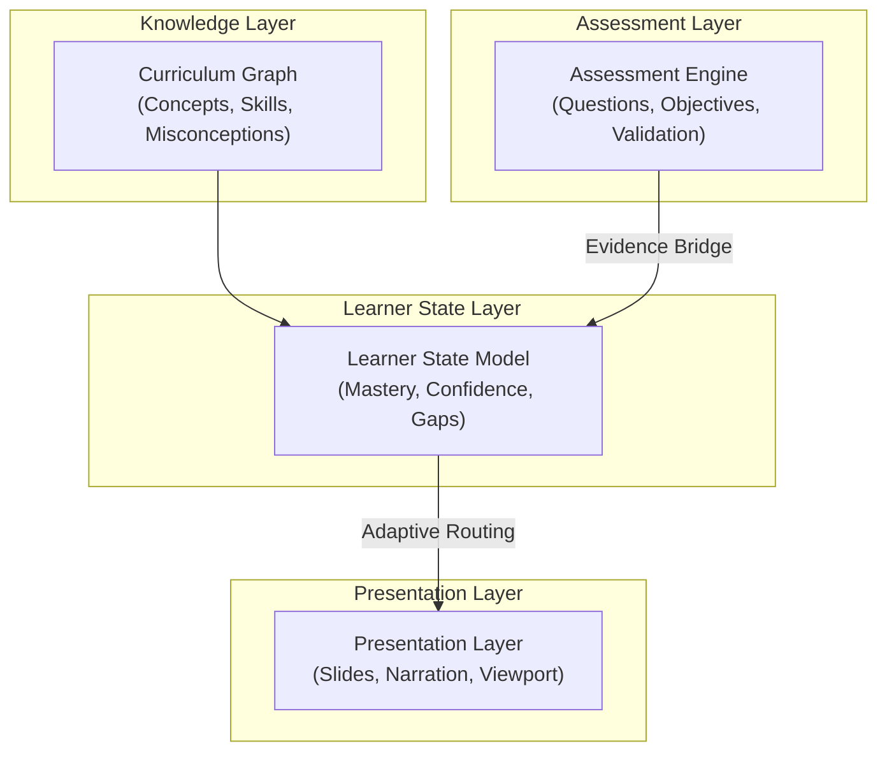

# EduVis Schema

**An open, curriculum-aware framework and knowledge representation for learning experiences.**

EduVis describes the **educational meaning** of learning experiences — modeling curriculum graphs, lesson progression, student actions, assessment evidence, learner state, and presentation layers. Renderers and player engines translate that meaning into interactive lessons, SVG, React, Flutter, PDF, or animated video.

Inspired by the philosophy behind Markdown, Mermaid, and Model Context Protocol (MCP):

> Separate meaning from rendering.

---

## Getting Started

**Requirements:** Python 3.10+

### Option 1: Install from PyPI (Recommended for general use)

```bash
pip install eduvis
```

### Option 2: Clone and run locally with uv (Recommended for development)

```bash
git clone https://github.com/seehiong/eduvis
cd eduvis
uv sync
```

Then prefix commands with `uv run` (or use the globally installed `eduvis` if installed via PyPI/pip):

```bash
# Validate showcase lessons
uv run eduvis validate docs/showcase/lessons/negative-numbers-confidence-ladder-lesson.yaml
uv run eduvis validate docs/showcase/features/adaptive-remediation-branching-lesson.yaml
uv run eduvis validate docs/showcase/features/visual-elements-catalog-lesson.yaml
uv run eduvis validate docs/showcase/features/assessment-schemas-lesson.yaml

# Render all showcase assets to docs/showcase/assets/
uv run python scripts/build_showcase.py

# Or render a single showcase lesson to a custom directory
uv run eduvis render docs/showcase/lessons/negative-numbers-confidence-ladder-lesson.yaml -o output/negatives/

# Utility commands
uv run eduvis docs --subjects math
uv run eduvis schema -o schemas/
```


### Option 3: Install locally with pip

```bash
git clone https://github.com/seehiong/eduvis
cd eduvis
pip install -e .
```

### Run the Tests

```bash
uv sync --extra dev
uv run pytest tests/ -v
```

### Code Quality and Maintainability Checks

To keep the codebase maintainable and clean, we enforce code quality and maintainability limits locally. These checks monitor:

1. **Cyclomatic Complexity**: Functions must have a McCabe complexity $\le 10$.
2. **Function Length**: Functions are restricted to a maximum of 50 statements.
3. **Nesting Depth**: Block nesting depth is restricted to at most 3 levels.
4. **Duplication Detection**: Code replication/duplication of 4 or more lines is flagged.
5. **Module Size**: Python files (modules) are limited to a maximum of 1000 lines.

To run these checks, ensure your development dependencies are synced:

```bash
uv sync --extra dev
```

Then run all quality checks with a single command:

```bash
uv run python scripts/run_checks.py
```

Alternatively, you can run the individual tools manually:

```bash
# Run Ruff for style, complexity, and function length
uv run ruff check eduvis tests scripts

# Run Pylint for nesting depth, module size, and duplication
uv run pylint eduvis tests scripts
```


To see every registered element type rendered to SVG in one pass:

```bash
uv run eduvis render docs/showcase/reference/exhaustive-element-catalog.yaml -o output/exhaustive_catalog/
```

This produces one SVG per element type (`test_number_line.svg`, `test_text_list.svg`, `test_math_grid.svg`, `test_solid_cube.svg`, … `test_solid_cylinder.svg`) — useful for checking renderer output after code changes.

---

## What EduVis Is

EduVis is **not** an SVG schema.

EduVis is a machine-readable instructional model.

It captures the structure of good tutoring — the same structure behind effective human instructors: no skipped steps, visual intuition before abstraction, confidence-building before challenge, and retrieval to lock it in long-term.

Crucially, it separates presentation (how to deliver), curriculum (what to learn), and student cognition (what is mastered) into orthogonal layers, allowing learning paths to adapt dynamically.

EduVis is to educational experiences what Markdown is to documents, Mermaid is to diagrams, and Model Context Protocol (MCP) is to context.

A specification can be rendered as SVG, PDF, slides, interactive lessons, or animated videos while preserving pedagogical intent.

---

## The Problem

Most diagram libraries describe visuals. EduVis describes **learning experiences**.

A number line in a textbook, a number line used to discover a rule, and a number line shown during a recall exercise are pedagogically different objects. They happen to look the same. Today's tools treat them identically.

```yaml
# What every library gives you
type: number_line
range: [-10, 10]
highlight: [-3, 5]
```

EduVis preserves the meaning that gets lost the moment most tools export to SVG:

```yaml
id: explore_number_line
type: number_line
placement:
  lesson_phase: explore
  memory_role: anchor
  difficulty: starter
actions:
  conceptual:
    - compare: [-3, 5]
range: [-10, 10]
```

But more importantly, EduVis describes where this element sits inside a proven teaching pattern — something no diagram library models at all.

---

## Specification Status & Tooling

This is not a theoretical schema. The placement model, element types, and LLM prompt vocabulary have been validated in real educational pipelines and are designed for production use.

> [!IMPORTANT]
> **Project Status: Beta (v0.x)**
> The schema is actively evolving during the v0.x phase. Backward compatibility guarantees will begin at v1.0. Breaking changes may occur between minor versions, but detailed migration guidelines, deprecation warnings, and automated schema migration tooling will be provided.

* **[Interactive Showcase](https://seehiong.github.io/eduvis/showcase/)**: View complete, production-grade lessons rendered to SVG.
* **[Live Schema Editor](https://seehiong.github.io/eduvis/showcase/editor.html)**: Write and preview your own EduVis YAML specifications in real-time. It runs the full Python rendering library entirely client-side in the browser using WebAssembly (Pyodide).

---

## Orthogonal Architecture Layers

To scale adaptive learning cleanly, EduVis separates learning content, curriculum dependencies, student assessment, and dynamic player delivery into four orthogonal concern layers:



### 1. Knowledge Layer (What to teach - Static Map)
*Schema definitions (`curriculum_graph`)*. Defines concepts, skills, misconceptions, dependency weights, and prerequisites statically before any student data is recorded.

### 2. Assessment Layer (Evidence & Verification)
*Schema definitions (`multiple_choice`, `short_answer`)*. Specifies how to check understanding cleanly (symbolic/numeric solvers, misconceptions mapping, multi-step checking) and maps assessment events to curriculum objectives.

### 3. Learner State Layer (What the learner knows - Dynamic GPS)
*Schema definitions (`learner_state`)*. Tracks dynamic mastery, confidence ratings, misconception states, and spaced repetition history for an individual student.

### 4. Presentation Layer (How to teach - Delivery)
*Companion specification (`presentation.yaml`)*. Controls reveal sequences, highlights, panning/viewport zoom, audio narration, and interactive player playback without altering the core pedagogical structure.

---

### The Mastery Graph View (Static Map + Dynamic GPS)
The real magic of adaptive learning comes from combining the static **Knowledge Layer (Curriculum Graph)** and the dynamic **Learner State**:

$$\text{Curriculum Graph} + \text{Learner State} = \text{Mastery Graph View}$$

Overlaying a student's current mastery levels onto the prerequisite map allows adaptive tutoring engines to trace weak points back to their source (e.g. if *Linear Equations* is weak, check *Algebraic Expressions* and remediate there first) rather than just giving a generic "wrong answer" notification.

---

## EduVis-Core

### Elements

The content types. Educational primitives, not drawing primitives.

```yaml
id: temperature_comparison
type: number_line
placement:
  lesson_phase: explore
  memory_role: example
range: [-10, 10]
highlight:
  - value: -3
    label: "-3°C"
    color: blue
  - value: 3
    label: "3°C"
    color: red
direction_labels:
  left: Colder
  right: Warmer
```

`number_line`, `fact_boxes`, `multiple_choice`, `hint_list` — these are pedagogical roles, not visual shapes. See [Element Reference](#element-reference) for the full vocabulary.

---

### Actions

What the element asks the student to do — the educational intent of the interaction.

```yaml
actions:
  conceptual:
    - compare: [-3, 5]          # notice a difference between two values
    - predict: unknown          # student fills in a missing value
    - identify: misconception   # student spots the error before it is revealed
    - retrieve: rule            # student recalls without looking back
    - apply: signed-number-ordering  # student applies a rule to a new case
  procedural:
    - substitute: { from: x, to: 3 }   # step-by-step transformation
    - simplify                  # reduce an expression
    - calculate                 # perform arithmetic
    - round: { decimal_places: 2 }
```

Actions are split into two categories:

**Conceptual** — what the student does cognitively:

| Action | What it means |
|---|---|
| `compare` | Draw attention to two elements in relation |
| `predict` | Student must supply a value before it is revealed |
| `identify` | Student spots the error or pattern before explanation |
| `retrieve` | Student recalls from memory without re-reading |
| `apply` | Student applies a rule to a new case |

**Procedural** — step-by-step mathematical transformations (the no-skipped-steps principle):

| Action | What it means |
|---|---|
| `substitute` | Replace a variable or expression — one explicit step |
| `simplify` | Reduce an expression — one explicit step |
| `calculate` | Perform arithmetic — one explicit step |
| `round` | Round to a specified precision — one explicit step |

Actions are **not** animation instructions. `compare` does not mean "animate an arrow between two values." It means "this element exists to make a comparison salient." The presentation layer decides how.

Procedural actions enforce `no_skipped_steps`: every transformation is named, so an AI generator cannot collapse two steps into one and a renderer can show working line by line.

---

### Relationships

How elements relate to other elements within a lesson. Enables lesson-level coherence checking and AI lesson assembly.

```yaml
relationships:
  anchors:
    - fraction_model          # this element is the concrete anchor for the concept
  contradicts:
    - misconception_example   # this element corrects the previous one
  precedes:
    - practice_question       # this element scaffolds the next element
  reinforces:
    - hook_scenario           # this element brings back the opening memory
```

| Relationship | What it means |
|---|---|
| `anchors` | This element establishes the concrete memory anchor for a concept |
| `contradicts` | This element corrects or challenges a previous element |
| `precedes` | This element scaffolds the element that follows |
| `reinforces` | This element recalls an earlier anchor to strengthen it |
| `parallels` | Two elements show the same concept at different abstraction levels |
| `remediation_for` | This element is shown when a student fails a linked element — scaffolds a retry |

**Adaptive tutoring pattern** — the `remediation_for` relationship encodes the CHECK → HINT branching loop used in intelligent tutoring systems without requiring a separate adaptive-paths pillar:

```yaml
- id: check_prime_identification
  type: multiple_choice
  placement:
    lesson_phase: independent_practice
    memory_role: practice
    difficulty: starter
  question: Which of these is a prime number?
  options: {A: "1", B: "2", C: "4", D: "6"}
  answer: "B"

- id: hint_prime_identification
  type: hint_list
  placement:
    lesson_phase: guided_practice
    memory_role: example
    purpose: worked_example
  relationships:
    remediation_for:
      - check_prime_identification
  items:
    - "List the factors of each option"
    - "A prime has exactly two factors: 1 and itself"
  final: "Choose the number with exactly two factors"
```

The runtime reads `remediation_for` and branches: show `check_prime_identification` first; if the student answers incorrectly, show `hint_prime_identification` and retry. The progression block still declares `guided_practice` before `independent_practice` — preserving pedagogical intent regardless of document order.

---

### Placement

Where the element lives in the lesson and in long-term memory. Three independent layers.

```yaml
placement:
  # Layer 1 — Layout: where on the screen
  layout_zone: center         # center | left | right | full | bottom
  visual_weight: primary      # primary | supporting

  # Layer 2 — Pedagogical: where in the lesson
  lesson_phase: explain       # hook | explore | explain | guided_practice | independent_practice | challenge | reflect | recall
  purpose: conceptual_model   # conceptual_model | worked_example | comparison | procedure | summary
  difficulty: routine         # starter | routine | challenge  (meaningful in practice phases)

  # Layer 3 — Memory: what role in retention
  memory_role: anchor         # anchor | example | practice | misconception_fix | retrieval | review
```

**Lesson phases:**

| Phase | What it means |
|---|---|
| `hook` | Concrete scenario before the concept is named |
| `explore` | Student observes a pattern before the rule is stated |
| `explain` | Rule or concept is revealed — `conceptual_model` purpose before `procedure` |
| `guided_practice` | Instructor walks through a worked example with the student following each step |
| `independent_practice` | Student applies the concept without guidance; difficulty set by `difficulty` field |
| `challenge` | Stretch problem that extends beyond routine application |
| `reflect` | Student articulates what they learned |
| `recall` | Student retrieves without re-reading — builds long-term memory |

**Difficulty levels** (used in `independent_practice` and `challenge` phases):

| Level | What it means |
|---|---|
| `starter` | Intentionally easy — builds confidence before the concept feels hard |
| `routine` | Typical exam-style problems — the core of independent practice |
| `challenge` | Harder realistic problems or stretch questions |

**Memory roles:**

| Role | What it means |
|---|---|
| `anchor` | The one element the student should remember weeks later |
| `example` | Demonstrates the concept in a specific case |
| `practice` | Used during in-lesson application |
| `misconception_fix` | Corrects a specific common error |
| `retrieval` | Shown during a recall exercise |
| `review` | Appears in a future lesson as a spaced repetition cue |

---

### Progression

The instructional flow of the whole lesson. This is the pillar that makes EduVis more than a diagram library.

Progression operates at the **lesson level**. Placement operates at the **element level**. Together they encode the teaching pattern — not just the individual elements, but the sequence that makes learning stick.

```yaml
progression:
  pattern: confidence_ladder      # the named teaching pattern
  pedagogy:
    confidence_first: true        # begin with starter problems before routine ones
    explain_why: true             # conceptual_model purpose before procedure
    no_skipped_steps: true        # every transformation is an explicit action
  phases:
    - phase: hook
    - phase: explore
    - phase: explain
      purpose: conceptual_model
    - phase: explain
      purpose: procedure
    - phase: guided_practice
      count: 1
    - phase: independent_practice
      difficulty: starter
      count: 3
    - phase: independent_practice
      difficulty: routine
      count: 5
    - phase: challenge
      count: 1
    - phase: recall
      count: 2
```

**Named patterns:**

| Pattern | What it means |
|---|---|
| `confidence_ladder` | Hook → Explore → Explain → Guided → Starter Practice → Routine Practice → Challenge → Recall. No steps skipped, confidence built before complexity introduced. |
| `direct_instruction` | Hook → Explain → Guided → Independent Practice → Recall. Shorter sequence for procedural topics where exploration is less useful. |
| `flipped_recall` | Recall → Hook → Explore → Explain → Practice. Opens with retrieval to activate prior knowledge before new content. |

**Pedagogy flags:**

| Flag | What it means |
|---|---|
| `confidence_first` | `starter` difficulty problems appear before `routine` ones |
| `explain_why` | A `conceptual_model` element precedes the `procedure` element |
| `no_skipped_steps` | Every mathematical transformation is an explicit action |

---

## Example

A single element from the Negative Numbers lesson — `explore` phase, number line, showing two temperatures for comparison:

```yaml
- id: explore_number_line
  type: number_line
  concepts:
    - negative_numbers
  placement:
    lesson_phase: explore
    memory_role: anchor
    difficulty: starter
  actions:
    conceptual:
      - compare: [-12, 32]
  relationships:
    anchors:
      - hook_temperature
  range: [-15, 35]
  highlight:
    - value: -12
      label: "Antarctica"
      color: blue
    - value: 32
      label: "Singapore"
      color: red
```

This element sits inside a `confidence_ladder` lesson that progresses through hook → explore → explain → guided practice → starter problems → routine problems → challenge → recall.

See [docs/showcase/lessons/negative-numbers-confidence-ladder.yaml](docs/showcase/lessons/negative-numbers-confidence-ladder.yaml) for the full lesson spec.

---

## Why the Five Pillars Matter

The insight from studying effective human tutors: the diagrams are about 20% of the value. The other 80% is the sequence.

Without EduVis, an AI lesson generator asks:

> *Draw three diagrams about negative numbers.*

With EduVis, it asks:

> *I need one `anchor` element in the `explore` phase, a `conceptual_model` before the `procedure` in the `explain` phase, one `guided_practice` worked example, three `starter` practice problems to build confidence, five `routine` problems, one `challenge`, and two `retrieval` items — following `confidence_ladder` with `explain_why` and `no_skipped_steps`.*

The generator is no longer assembling graphics. It is assembling a **learning experience** — one that follows the same structure that makes great human tutors effective.

The instructional patterns that live inside the heads of great tutors become explicit, machine-readable, and consistently reproducible. That is the gap no SVG library, diagram tool, or LLM prompt currently fills.

---

## Using with LLMs

EduVis exposes its full five-pillar vocabulary as a runtime-generated system prompt block — the same pattern MCP uses to announce tool schemas to a model.

Inject it before asking an LLM to write lesson specs:

```python
from eduvis.core import format_prompt_docs

system_prompt = f"""
You are an instructional designer writing EduVis lesson specs.
Follow the schema exactly — only use elements, phases, and actions listed below.

{format_prompt_docs(["math"])}
"""
```

Or generate it from the CLI:

```bash
python -m eduvis docs --subjects math
python -m eduvis docs --subjects math --output vocab.txt
```

The vocabulary covers all five pillars in one block: lesson skeleton, progression patterns, placement model, actions vocabulary, relationship types, and element field schemas — everything an LLM needs to produce a valid spec without guessing at field names.

**Sample output** — the block below is generated from `python -m eduvis docs --subjects math` at the current release. It is illustrative, not exhaustive; the actual output updates automatically as elements are added.

<details>
<summary>View sample LLM vocabulary (v0.1, math)</summary>

> Full reference: [docs/llm_system_prompt.md](docs/llm_system_prompt.md)

```
## EduVis Lesson Structure

Every lesson YAML has five top-level keys: schema_version, curriculum, lesson, progression, content.

schema_version: "0.7"

curriculum:
  code: string            # curriculum code e.g. "SEC-math-2027"
  topic: string           # topic code e.g. "N1.6"
  concept: string         # optional target concept name
  requires:               # optional list of prerequisite concept names
    - string
  supports:               # optional list of supporting concept names
    - string
  learning_outcomes:      # optional list of target learning outcomes
    - string
  assessment_targets:     # optional list of assessment targets / objectives
    - string

lesson:
  title: string           # human-readable lesson title
  concepts:               # optional list of target concepts
    - string

progression:
  pattern: confidence_ladder | direct_instruction | flipped_recall
  pedagogy:
    confidence_first: true | false
    explain_why: true | false
    no_skipped_steps: true | false
  phases:
    - phase: <lesson_phase>
      purpose: <purpose>       # optional, use in explain phase
      difficulty: <difficulty> # optional, use in practice phases
      count: <integer>         # optional, number of elements in this phase

content:
  - id: string             # unique identifier within the lesson
    type: <element_type>   # see Element Types below
    concepts:              # optional list of concepts taught by this element
      - string
    placement:
      lesson_phase: hook | explore | explain | guided_practice |
                    independent_practice | challenge | reflect | recall
      memory_role:  anchor | example | practice | misconception_fix |
                    retrieval | review
      difficulty:   starter | routine | challenge   # optional
      purpose:      conceptual_model | procedure | worked_example |
                    comparison | summary             # optional
    actions:                                        # optional
      conceptual:
        - compare: [-3, 5]
        - predict: unknown
      procedural:
        - substitute: {from: x, to: 3}
        - simplify
    relationships:                                  # optional
      anchors:         [hook_temperature]
      precedes:        [practice_starter_1]
      remediation_for: [check_element_id]
    <element-specific fields...>

## Element types (math, v0.7.0)
  number_line      range, highlight, direction_labels, caption
  fraction_model   shape: circle|bar|grid, total_parts, shaded_parts
  bar_model        bars: [{label, value, color}], difference
  coordinate_plane x_range, y_range, plots: [{type, equation, color}]
  geometry_shape   vertices, labels, side_labels, angles
  solid_shape      shape: cube|cone|cylinder|pyramid|rectangular_prism|triangular_prism, dimensions, color, show_dimensions, label
  factor_array     number: N
  math_grid        rows: [[cells]], headers
  text_list        items: [strings]
  structured_response question, parts: [{id, question, answer_type: algebraic|exact|numeric|reasoning, answer, marks, depends_on, skills}], marking: {error_carry_forward, rubrics}
  fact_boxes       items: [{text, border_color}]
  example_panel    items: [{heading, body}]
  callout_box      title, lines, border_color
  summary_list     items: [strings]
  multiple_choice  question, options: {A, B, C, D}, answer, misconceptions, solution_steps
  short_answer     question, answer, evaluation_mode: algebraic|exact|numeric, solution_steps
  remediation_block review: {source_question, student_answer, correctness}, concept_card: {heading, body}, step_by_step: {heading, steps}
  hint_list        items: [strings], final: string
```

</details>

---

## 3D Geometry: Solid Shapes

The `solid_shape` element renders 3D solids using isometric projection—perfect for teaching volume, surface area, and spatial reasoning.

```yaml
type: solid_shape
shape: cylinder                    # cube, rectangular_prism, pyramid, cone, cylinder, etc.
dimensions: [3, 5]                # [width, height] for cone/cylinder; [w, h, d] for prism
color: blue
label: "Volume = πr²h"            # optional label below shape
show_dimensions: true             # optional: overlay radius/height measurements on shape
```

**Supported shapes:**
- `cube` — regular cube (use single dimension: `[side]`)
- `rectangular_prism` — box with custom width, height, depth (`[w, h, d]`)
- `triangular_prism` — prism with triangular cross-section
- `pyramid` — square pyramid with apex
- `cone` — circular cone with apex (`[diameter, height]`)
- `cylinder` — circular cylinder (`[diameter, height]`)

**Features:**
- **Isometric projection** — automatic 3D perspective from 2D coordinates
- **Auto-scaling** — all shapes fit the content zone, dimensions stay proportional
- **Dimension labels** — use `show_dimensions: true` to overlay radius/height measurements (yellow text)
- **Custom labels** — `label` field renders below the shape for captions or formulas

**Cylinder improvements:**
- Darker bottom, lighter top to emphasize 3D depth
- All 16 vertical edges visible
- Bold top edge outline

See `docs/showcase/reference/exhaustive-element-catalog.yaml` for live examples: `test_solid_cube.svg`, `test_solid_cone.svg`, `test_solid_cylinder.svg`, etc.

---

## Python API Usage

You can easily integrate `eduvis` validation and prompt generation into your custom Python scripts and LangChain pipelines.

### Programmatic Validation
Validate lesson specs dynamically:
```python
import yaml
from eduvis.core import validate_lesson

# Load your generated lesson YAML
with open("lesson.yaml", "r") as f:
    lesson_data = yaml.safe_load(f)

# Run the five-pillar validator
warnings = validate_lesson(lesson_data)
if not warnings:
    print("Lesson is valid!")
else:
    print(f"Validation warnings: {warnings}")
```

### Programmatic LLM Vocabulary (LangChain Integration)
Retrieve the vocabulary string to inject directly into your LangChain prompt templates:
```python
from langchain_core.prompts import ChatPromptTemplate
from eduvis.core import format_prompt_docs

# Generate curriculum-specific vocab docs (e.g., for Mathematics)
eduvis_vocab = format_prompt_docs(["math"])

# Inject into LangChain Prompt Templates
prompt = ChatPromptTemplate.from_messages([
    ("system", "You are an instructional designer. Use the following EduVis schema rules:\n\n{vocab}"),
    ("human", "Generate a lesson spec for: {topic}")
])

chain = prompt | llm
# result = chain.invoke({"vocab": eduvis_vocab, "topic": "adding fractions"})
```

---

## Element Reference

**Current focus: Mathematics.**

Science and Humanities element types and renderers are planned for a future release.

> [docs/showcase/reference/exhaustive-element-catalog.yaml](docs/showcase/reference/exhaustive-element-catalog.yaml) contains one working slide per element type. Run it with `eduvis render` to get a visual catalog of every renderer.

### Generic — all subjects

| Element | Synopsis |
|---|---|
| `text_list` | `items: [strings]` |
| `fact_boxes` | `items: [{text, color}]` |
| `example_panel` | `items: [{heading, body}]` |
| `callout_box` | `title, lines, color` |
| `summary_list` | `items: [strings]` — use on closing elements |
| `multiple_choice` | `question, options: {A, B, C, D}` |
| `short_answer` | `question, answer, evaluation_mode` |
| `remediation_block` | `review: {source_question}, remember: {type, ...}, solve: {type, ...}` |
| `hint_list` | `items: [strings], final: string` |
| `number_line` | `range, highlight, direction_labels, caption` |
| `mixed_card` | `ribbon_type: solve\|remember\|review, ribbon_label, items: [{type, ...}]` — mixed layout |

### Mathematics

| Element | Synopsis |
|---|---|
| `fraction_model` | `shape: circle\|bar\|grid, total_parts, shaded_parts` |
| `bar_model` | `bars: [{label, value, color}], difference` |
| `coordinate_plane` | `x_range, y_range, plots: [{type, equation, color}]` |
| `geometry_shape` | `vertices, labels, side_labels, angles` |
| `factor_array` | `number: N` — dot grid for factors and primes |
| `math_grid` | `rows: [[cells]], headers` — column arithmetic |
| `fraction_equation` | `terms: [strings\|objects]` — vertical fractions equation layout |
| `solid_shape` | `shape: cube\|prism\|pyramid\|cone\|cylinder, dimensions, color, label` — isometric 3D geometry |

---

## EduVis-Presentation (v0.3)

The presentation layer is a companion specification that sits on top of EduVis-Core. It controls the animation, reveal sequencing, and interactive player behavior without modifying the underlying pedagogical meaning.

```yaml
presentation:
  slides:
    - id: explore_number_line
      advance: manual
      duration: 5.0
      reveals:
        - target: explore_number_line
          steps:
            - index: 0
              visible_items: [0]
              caption: "Let's compare these two temperatures."
            - index: 1
              visible_items: [0, 1]
              highlight: 
                target: "value_-12"
                style: "pulse"
              viewport:
                zoom: 1.5
                center: [-12, 0]
```

**Key Features:**
- **Slides**: Maps to existing Core element IDs.
- **Reveals**: Step-by-step unhiding of element internals (e.g., list items, math grid rows).
- **Viewport**: Declarative zoom and pan commands.
- **Highlights**: Animate specific targets to draw attention.
- **Audio/Timing**: `audio_file`, `audio_offset`, and `auto_advance_after` for narration syncing.

### IDE Schema Validation
To enable autocomplete, tooltips, and real-time schema validation in IDEs (like VS Code with the YAML extension), reference the schema at the top of your files:

For lesson YAML files:
```yaml
# yaml-language-server: $schema=https://raw.githubusercontent.com/seehiong/eduvis/main/schemas/lesson.schema.json
curriculum:
  code: s1_sec_math
```

For sidecar `presentation.yaml` files:
```yaml
# yaml-language-server: $schema=https://raw.githubusercontent.com/seehiong/eduvis/main/schemas/presentation.schema.json
slides:
  - id: slide_01
    advance: manual
```

---

## Roadmap

### - [x] v0.1 — Core Schema and SVG Renderer
- Formal JSON Schema for all element types
- Placement model: all three layers, including `difficulty`
- Actions vocabulary: initial set including step-by-step transformation actions
- Progression model: named patterns and pedagogy flags
- Built-in SVG reference renderer
- Secondary Mathematics examples

### - [x] v0.2 — Curriculum Knowledge Model
- Relationships between elements within a lesson
- Curriculum metadata block (`code`, `topic`)
- Lesson-level pedagogical validation (chronological sequence, progression coverage, concepts coherence, anchor density limits)
- Learning outcomes mapping
- Prerequisite and remediation relationships
- Assessment objectives
- Curriculum graph validation

### - [x] v0.3 — EduVis-Presentation
- Interactive presentation mode (v0.3.0 player)
- Companion `presentation` schema layered cleanly over Core
- Reveal sequencing, highlight/zoom annotations, and viewport commands
- Narration timing hooks

### - [x] v0.4 — Assessment and Validation Engine
- Canonical action validation model
- Step-by-step solution representation
- Rule-based answer checking (client-side, no LLM inference)
- Symbolic equivalence checking
- Misconception detection rules
- Assessment event schema
- Canonical assessment objective vocabulary (`procedural_fluency`, `conceptual_understanding`, `application`, `reasoning`)
- Mastery model and Assessment objective mapping
- **Assessment Evidence Bridge (Static Mapping)**: Static metadata framework mapping assessment events (e.g. `objective: procedural_fluency`) to the concepts, skills, or misconceptions they produce evidence for.

### - [x] v0.5 — Curriculum Graph and Knowledge Engine
- **Static Curriculum Graph Representation**:
  - Explicit taxonomy mapping: Concepts, Skills, and Misconceptions
  - Concept Dependency Maps: Prerequisite (`from` / `to`) and support relationships
  - **Knowledge Importance Model**: Weighting concepts, skills, and misconceptions by exam relevance (`exam_weight`), graph centrality (`centrality_weight`), and remediation weight (`remediation_weight`)
- **Curriculum Analytics**:
  - Concept centrality analysis (identifying key bottleneck concepts)
  - Outcome coverage analysis
  - Dependency gap detection
  - Curriculum completeness validation
- **Curriculum Traversal APIs** to query relationships programmatically

### - [x] v0.6 — Assessment Reasoning, Pedagogical Intent, and Diagnostic Evidencing
- **Diagnostic Assessment & Evidence Modeling**:
  - Standardized diagnostic metadata fields inside MCQ, short-answer, and structured-response elements.
  - Weighted concept mapping (`assesses: {concept_id: weight}`) for multi-concept questions.
  - Static diagnostic reliability metadata (`evidence_strength: high | medium | low`) placed directly on the assessment elements to represent their inherent diagnostic weight.
  - Multi-dimensional cognitive challenge profiling (replacing flat difficulty with `cognitive_skills` e.g., recall/apply/reason and `challenge_factors` e.g., multi-step/unfamiliar context).
  - Explicit step-by-step rubrics linking criteria to expected evidence targets, marks, and specific misconceptions.
  - Declarative marking policies supporting partial credit and Error Carry Forward (ECF) dependencies.
- **Assessment Reasoning & Multi-part Problems**:
  - `structured_response` element type for multi-part structured questions.
  - Validation of part-level dependencies (`depends_on`) to enable Error Carry Forward (ECF) marking.
  - Precedence constraints to prevent circular or forward-referencing dependencies.
  - `reasoning_path` sequence (e.g., `represent` -> `formulate` -> `transform` -> `solve` -> `verify`) to map the expected cognitive/thinking path assessed, distinct from the rubric's marking criteria.
- **Pedagogical Intent Modeling (Reduced Scope)**:
  - `pedagogical_intent` configuration block inside placement specifications to guide lesson generation and adaptivity (e.g., `intent: confidence_building`).
  - `scaffolding_level` configuration to specify content support depth (e.g., `high`, `medium`, `low`).
  - *Note: Presentation-level details (such as narrative tone/theme) are cleanly deferred to the presentation/renderer layers.*
- **Decoupled Learner State**:
  - Decoupled dynamic runtime telemetry models (`learner_state` / mastery logs) from static content definitions to maintain a pure core schema definition layer.

### - [x] v0.7 — Learner State, Mastery, and Assessment Orchestration
- **EduVis-Assessment wrapper package**:
  - `assessment_paper.schema.json` container mapping exam/quiz structures (sections, question lists, calculator guidelines).
  - `paper_blueprint.schema.json` mapping concept and cognitive skill targets to exam mark allocations.
  - `generate_blueprint()` — automated blueprint generation from the Curriculum Graph (blended exam_weight + centrality_weight).
  - `validate_paper_coverage()` — paper coverage validation and blueprint analytics comparing actual exam papers against target blueprints.
  - `assemble_paper()` — automated exam/paper assembly using graph-scored element selection against blueprint targets.
- **Dynamic Learner State Representation**:
  - `learner_state.json` runtime sidecar (+ `LearnerState` Python class) mapping dynamically onto the static `curriculum.yaml` graph nodes.
  - Granular, session-transient mastery tracking for all three levels: Concepts, Skills, and Misconceptions.
  - Strict demarcation between **Static Content Specs** (YAML) and **Dynamic Runtime State** (JSON).
- **Stateless Transition Engine (Runtime)**:
  - `apply_telemetry_event()` — pure Evidence Bridge: `Transition(current_state, event, curriculum) -> new_state`.
  - `telemetry_event.schema.json` conformance schema; temporal mastery decay built in.
- **Mastery Graph Projection**:
  - `MasteryGraphView` — combines static Curriculum Graph with dynamic LearnerState for real-time mastery views with prerequisite gap detection.
- **Revision & Knowledge Condensation Engine**:
  - `get_top_concepts()` — weight-ranked concepts to study next (exam_weight × centrality × mastery gap).
  - `get_top_misconceptions()` — active misconceptions ranked by remediation_weight.
  - `generate_study_plan()` — time-bounded study plan with four modes: `lesson`, `revision`, `exam_prep`, `crash_course`.
- **Adaptive Remediation & Paths**:
  - `trace_prerequisite_failure_root()` — traces prerequisite dependency graph backward to the deepest unmastered root.
  - `select_next_element()` — scores available lesson elements against learner state and picks the best next element.
  - `generate_hint()` — derives a targeted hint from element's `misconceptions` + `solution_steps` matched to the wrong answer.
- **Spaced Repetition (SM-2)**:
  - `update_review_schedule()` — SM-2 algorithm: updates interval, ease_factor, and next_review_at after each review.
  - `get_due_elements()` — returns element IDs due for review on a given date.
  - `get_schedule_summary()` — aggregate stats: total tracked, due today, overdue, upcoming, average ease.

### - [ ] v0.8 — Tooling, Interactive Visualizations, and Multi-Lens Explorer (Upcoming)
- **Interactive Curriculum Graph Explorer**:
  - Transition the Live Editor's static Mermaid diagram into an interactive graph canvas (e.g., force-directed layout using Cytoscape.js or D3.js).
  - **Local Dependency Inspector**: Implement a slide-out/inspector panel to detail prerequisites, successors, associated skills, and misconceptions when clicking a node.
- **Workspace of Projections (Tabbed Interfaces)**:
  - *Lesson View*: Visual preview canvas and interactive presentation player.
  - *Curriculum View*: Graph-wide dependency map with automated coverage and gap alerts.
  - *Assessment View*: Question alignment checker mapping assessment elements to target concept and skill nodes.
  - *Learner View*: Visual mastery/gap heatmap overlay projected on top of the curriculum graph using the dynamic `learner_state` sidecar.
- **Bidirectional Visual Editing (Long-Term)**:
  - Enable dragging and connecting nodes in the interactive explorer to automatically update YAML schemas in the code editor.

### - [ ] v0.9 — AI Generation, Tutoring, and Schema Migration (Upcoming)
- **Graph-Driven Lesson Generation**: Automatically generate EduVis lesson specs directly from the Curriculum Graph (Curriculum Graph $\to$ Lesson Generator $\to$ EduVis Lesson) rather than simple text prompting.
- Tutoring workflows and visual asset generation.
- **Migration CLI & Upgrades**: Introduction of migration tooling framework and automated schema upgrade paths (`eduvis migrate`) to upgrade schemas between versions.

### - [ ] v1.0 — Autonomous Curriculum Factory (Upcoming)
- Agent-based curriculum generation
- Curriculum review workflows
- Standards mapping and multi-framework support
- Curriculum QA and Syllabus generation

---

### Governance and Quality (Parallel Track)

To keep the EduVis ecosystem stable for downstream renderers and player platforms, we adhere to the following governance frameworks:

* **Schema Versioning**: Starting in `v0.5.0` (currently `v0.7.0`), documents should include a top-level `schema_version` property (e.g., `schema_version: "0.7"`). The validator issues a warning if it is missing and raises an error for incompatible schema versions.
* **Schema Stability Lifecycle**: All schema fields are categorized under one of four lifecycle tiers:
  * **Experimental**: Active beta iteration. Fields may change or be removed at any minor version.
  * **Stable**: Production-ready. Backwards compatibility is guaranteed.
  * **Deprecated**: Scheduled for removal. Emits warnings directing users to newer fields.
  * **Removed**: Excised from the parser.
* **RFC Process**: Any change to **Stable** fields, new top-level schema blocks, or relationship modifications must go through a Request for Comments (RFC) process. Use the template in `docs/rfcs/template.md` to submit proposals.
* **Deprecation and Aliasing Strategy**: When updating the schema, the parser will support legacy keys (with warnings) for at least one minor version before they are retired.
* **Migration CLI**: Prior to `v1.0.0`, a migration tool (`eduvis migrate`) will be introduced to automatically rewrite legacy document schemas using comment-preserving parsers.
* **Validation Suites**: Automated schema test suites to prevent regression.
* **Contributor Guidelines**: Clear instructions for extending schema features and renderers.
* **Reference Implementations**: Canonical lesson and topic specifications.

---

## Project Structure

```text
eduvis/ (repository root)
├── pyproject.toml            ← package metadata and dependencies
├── uv.lock                   ← pinned dependency versions
├── LICENSE                   ← Apache 2.0 License
├── README.md                 ← this documentation file
├── .gitignore                ← untracked files to ignore
│
├── eduvis/                   ← Python package source code
│   ├── __init__.py           ← package entrypoint & exported APIs
│   ├── __main__.py           ← entrypoint for running directly as a script
│   ├── cli.py                ← Click CLI commands implementation
│   │
│   ├── core/                 ← EduVis-Core: schema, validation, prompt vocabulary
│   │   ├── registry.py       ← ElementRegistry (specifications list + prompt docs)
│   │   ├── validator.py      ← five-pillar lesson validator
│   │   ├── prompt.py         ← format_prompt_docs() for LLM prompts
│   │   ├── curriculum.py     ← CurriculumGraph, dependency traversal, coverage analytics
│   │   ├── learner_state.py  ← LearnerState — concept/skill/misconception mastery
│   │   ├── transition_engine.py ← apply_telemetry_event() — stateless SM evidence bridge
│   │   ├── mastery_projection.py ← MasteryGraphView — curriculum graph + learner state
│   │   ├── blueprint_engine.py  ← generate_blueprint / validate_paper_coverage / assemble_paper
│   │   ├── revision_engine.py   ← get_top_concepts / get_top_misconceptions / generate_study_plan
│   │   ├── remediation_engine.py ← trace_prerequisite_failure_root / select_next_element / generate_hint
│   │   ├── spaced_repetition.py ← SM-2 scheduler: update_review_schedule / get_due_elements
│   │   ├── elements/
│   │   │   ├── generic.py    ← generic element field definitions
│   │   │   └── math.py       ← mathematics element field definitions
│   │   └── schemas/
│   │       ├── placement.py  ← schema definitions for placement (phases, roles)
│   │       ├── actions.py    ← schema definitions for actions
│   │       ├── relationships.py ← schema definitions for relationships
│   │       └── progression.py ← schema definitions for progression patterns
│   │
│   ├── renderers/
│   │   └── svg/              ← Python reference renderer (SVG output)
│   │       ├── spec_renderer.py  ← SVGSpecRenderer — YAML spec to SVG
│   │       ├── primitives.py     ← canvas constants and drawing helpers
│   │       ├── renderers_base.py ← generic element renderers
│   │       └── renderers_math/   ← mathematics element renderers
│   │
│   └── schemas/              ← pre-generated JSON Schema files packaged with the library
│       ├── lesson.schema.json
│       ├── placement.schema.json
│       ├── actions.schema.json
│       ├── relationships.schema.json
│       ├── progression.schema.json
│       ├── learner_state.schema.json
│       ├── telemetry_event.schema.json
│       ├── assessment_paper.schema.json
│       └── paper_blueprint.schema.json
│
├── docs/                     ← Documentation and showcase files
│   ├── llm_system_prompt.md  ← generated vocabulary reference for LLMs
│   └── showcase/
│       ├── lessons/               ← complete teaching flows (one pattern per file)
│       │   └── negative-numbers-confidence-ladder-lesson.yaml
│       ├── features/              ← one feature family per file
│       │   ├── adaptive-remediation-branching-lesson.yaml
│       │   ├── visual-elements-catalog-lesson.yaml
│       │   └── assessment-schemas-lesson.yaml
│       └── reference/             ← reference catalogs
│           ├── exhaustive-element-catalog.yaml
│           └── mixed-content-card.yaml

│
├── schemas/                  ← pre-generated JSON Schema files at the repository root
│   ├── placement.schema.json
│   ├── actions.schema.json
│   ├── relationships.schema.json
│   ├── progression.schema.json
│   └── lesson.schema.json
│
└── tests/                    ← Test suite
    ├── test_validate.py      ← validator smoke tests
    └── test_schema_export.py ← JSON Schema export smoke tests
```


---

## Long-Term Vision

```text
Learning Intent
       ↓
EduVis-Core  (educational meaning — stable, renderer-agnostic)
  Elements · Actions · Relationships · Placement · Progression
       ↓
EduVis-Presentation  (timing, animation — renderer-specific, layered on top)
       ↓
Any target: SVG · React · Flutter · PDF · YouTube · Interactive platform
```

Just as Markdown became the standard for text, EduVis aims to become the standard for educational content — where **progression, placement, and actions are as important as the element itself**.

---

## Status

Early design. Reference implementation live in Nova Tutor (Singapore Secondary Mathematics).

Contributions and feedback welcome.

---

## License

This project is licensed under the Apache License 2.0. See [LICENSE](LICENSE) for details.
