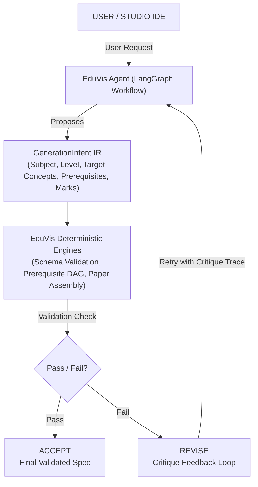
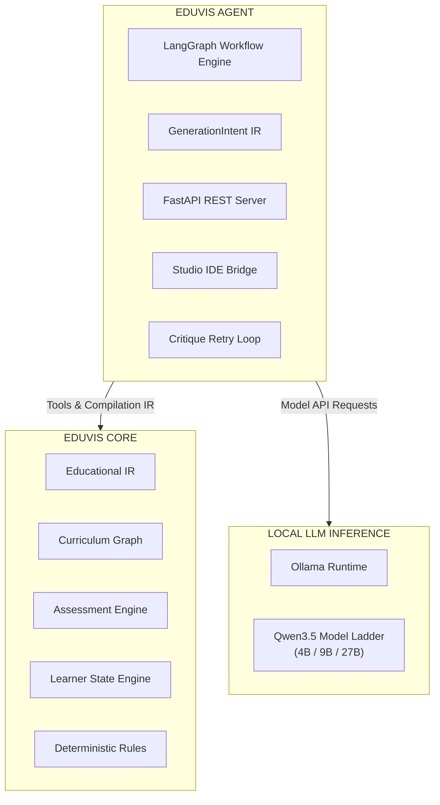
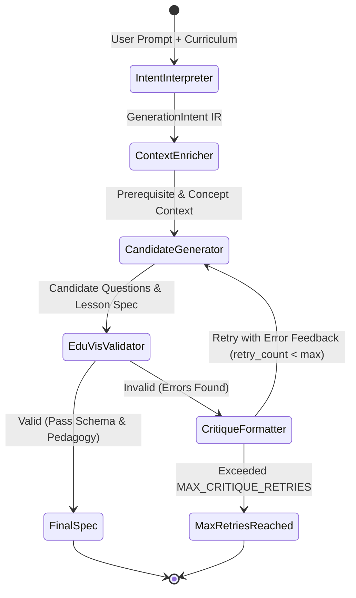

# EduVis Agentic Generation Substrate (v1.3)

This document details the architectural specification, graph lifecycle, and integration pattern for **EduVis v1.3 Agentic Generation**.

---

## 1. Core Architectural Principle

> **"LLM Proposes. EduVis Validates, Reasons, Assembles, and Compiles."**

Generic AI lesson generators fail because they expect language models to simultaneously perform creative text synthesis, enforce prerequisite DAG constraints, balance exam mark distributions, and output syntactically pristine YAML schemas.

EduVis v1.3 solves this by separating **proposals** from **compilation**:



---

## 2. Decoupled Architecture Layers

To preserve the zero-dependency nature of `EduVis Core`, the agentic generation substrate is isolated within the `agent/` package:



---

## 3. Intermediate Representation (`GenerationIntent`)

Instead of asking local models to produce complex raw YAML directly, the LLM maps user instructions into a high-contrast Pydantic IR (`GenerationIntent`):

```python
class GenerationIntent(BaseModel):
    subject: str = "mathematics"
    level: str = "Secondary 1"
    topic: str = "negative_numbers"
    
    target_concepts: list[str]
    prerequisites: list[str]
    misconceptions: list[str]

    difficulty_target: str = "medium"
    total_marks: int = 60
    question_count: int = 10
    
    objective_distribution: AssessmentObjectiveAlloc
    diagnostic_ratio: float = 0.2
```

The EduVis deterministic paper assembly engine takes this IR, verifies concept dependencies, and greedily selects/assembles validated items into final specs.

---

## 4. Educational Generation Graph Lifecycle



1. **Intent Interpreter**: Maps user prompt into `GenerationIntent` IR.
2. **Context Enricher**: Queries `EduVis Core` graph for transitive prerequisites and learning objectives.
3. **Candidate Generator**: Requests candidate questions or lesson cards from local LLMs.
4. **EduVis Validator**: Invokes deterministic EduVis schema/pedagogy checks and greedy paper assemblers.
5. **Critique Formatter**: Formats error tracebacks as feedback if validation fails, looping back to step 3 up to `MAX_CRITIQUE_RETRIES`.

---

## 5. Agent Setup & Deployment Guide

### Quick Start Prerequisites
- Python 3.10+
- `ollama` installed and running locally

### Installation & Environment Setup
```bash
# 1. Install dependencies with agent support
pip install -e .

# Optional environment overrides (defaults shown)
export OLLAMA_BASE_URL="http://localhost:11434"
export EDUVIS_MODEL_DEFAULT="qwen3.5:9b"
export EDUVIS_AGENT_PORT=8000
```

### Running the Agent Service
```bash
# Step 1: Ensure Ollama model is available
ollama run qwen3.5:9b

# Step 2: Launch EduVis Agent REST Server (run from the repository root)
cd eduvis
python -m agent.server
```

### REST API Reference (`agent/server.py`)
| Endpoint | Method | Description |
|---|---|---|
| `/health` | `GET` | Server status and model configuration audit |
| `/api/generate/paper` | `POST` | Executes full stateful graph generation pipeline |
| `/api/validate` | `POST` | Runs deterministic EduVis schema & pedagogy checks |

