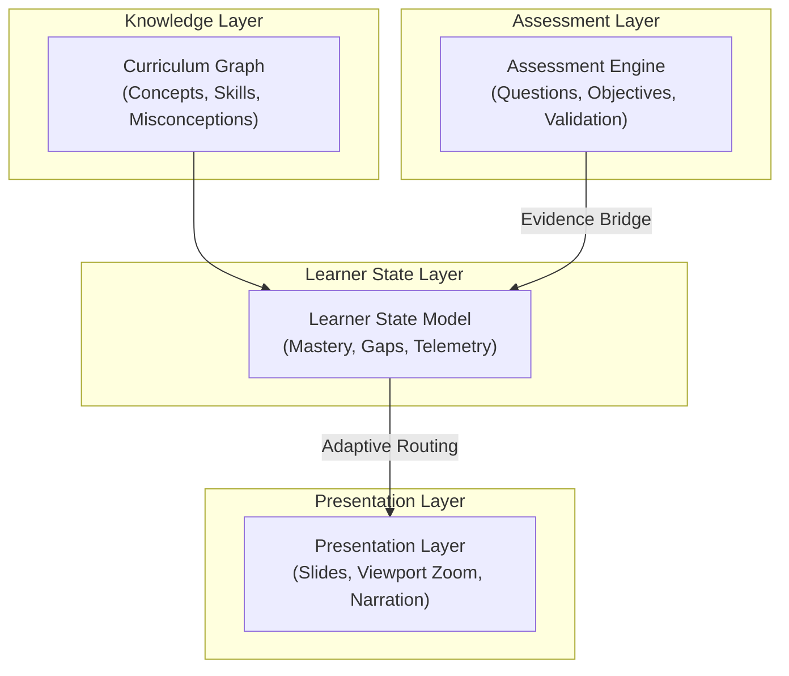

# EduVis: Architectural Layers & Schema Structure

This document details the layered architecture, static vs. dynamic schemas, and intermediate representation (IR) structure of the EduVis framework.

---

## Orthogonal Architecture Layers

EduVis separates content, dependencies, telemetry, and layout into four decoupled concern layers:



### 1. Knowledge Layer (Static Map)
* **Abstractions**: `curriculum.yaml`.
* **Purpose**: Defines concepts, skills, misconceptions, prerequisite dependencies, outcome mapping, and weights (exam relevance, graph centrality).
* **Properties**: Static, read-only at runtime. Shared globally across multiple lessons.

### 2. Assessment Layer (Testing Logic)
* **Abstractions**: Question elements (`multiple_choice`, `short_answer`, `structured_response`).
* **Purpose**: Declares symbolic correctness, misconception detectors, step-by-step rubrics, partial credit mappings, and Error Carry Forward (ECF) dependencies.
* **Properties**: Client-side checkable (no LLM required at runtime).

### 3. Learner State Layer (Dynamic Context)
* **Abstractions**: `learner_state.json`.
* **Purpose**: Tracks transient concept and skill mastery, active/remediated misconceptions, confidence ratings, and spaced-repetition (SM-2) schedules.
* **Properties**: State is strictly decoupled from content schemas. Updated dynamically via stateless transitions.

### 4. Presentation Layer (Delivery Medium)
* **Abstractions**: `presentation.yaml`.
* **Purpose**: Controls reveal sequencing, audio narration triggers, zoom/pan annotations, and advance modes (manual/auto).
* **Properties**: Maintained as a sidecar, allowing content to render as SVG, React components, PDFs, or slides without altering pedagogical meaning.

---

## Schema Categorization

EduVis organizes its schema files into three distinct functional groups:

| Group | Schema File | Role |
|---|---|---|
| **Core Specifications (Static)** | `curriculum.schema.json` <br> `lesson.schema.json` <br> `presentation.schema.json` | Used by content designers and compiler front-ends to author static curriculum maps, slide sequences, and presentation details. |
| **Runtime Sidecars (Dynamic)** | `learner_state.schema.json` <br> `telemetry_event.schema.json` <br> `assessment_event.schema.json` | Used by tutoring and player runtimes to capture student attempts, trace mastery updates, and record session logs. |
| **Derived Artifacts (Generated)** | `assessment_paper.schema.json` <br> `paper_blueprint.schema.json` | Generated programmatically (e.g. via Graph-driven paper assembly) to represent exam blueprints and custom-compiled assessments. |

---

## The Compiler & IR Model

EduVis operates under the mental model of a **Curriculum Compiler**. Instead of compiling programming code into machine code, it compiles pedagogical graphs and lesson structures into multiple delivery formats.

```text
Syllabus / Concept Graph
          ↓
  [Curriculum Compiler]
          ↓
  EduVis Schemas (IR) — curriculum.yaml, lesson.yaml, presentation.yaml
          ↓
  [Renderer / Player Engines]
          ↓
  Web Lessons · Voice Tutoring · Interactive Slide Decks · Exam PDFs
```

In this pipeline, **EduVis serves as the Pedagogical Intermediate Representation (IR)**. The core library is kept strictly stateless: it provides parsers, schemas, and validators that define the contracts between front-end generators (e.g., AI agents, authoring tools) and back-end deliverers (e.g., React renderers, PDF exporters).
